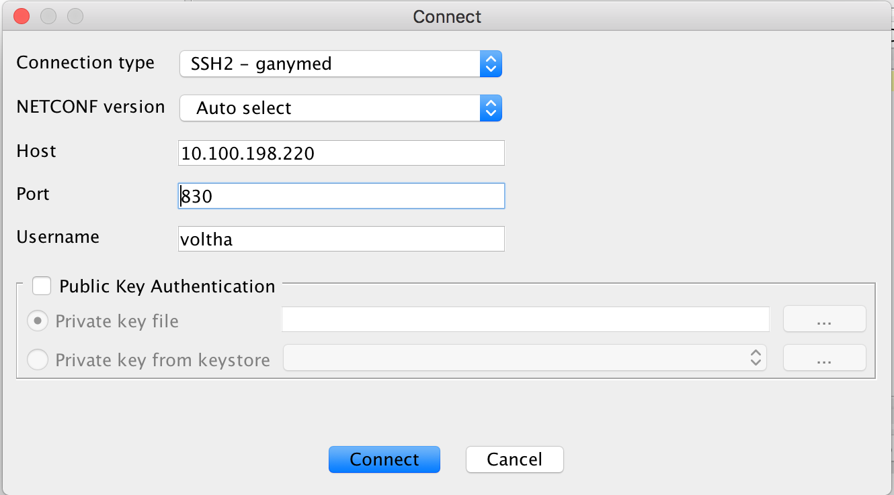
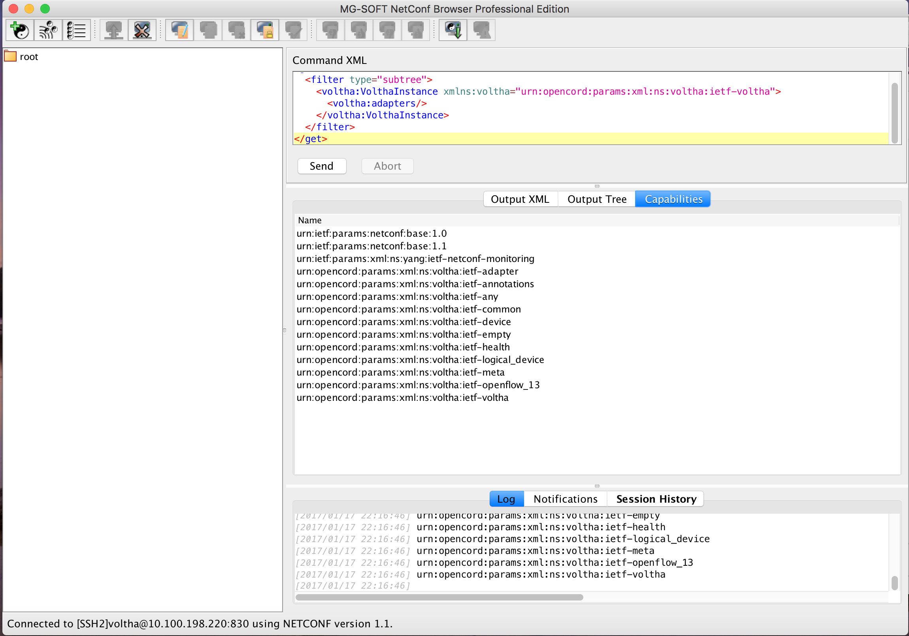

## N2 - Connect to Netconf Server using a Netconf Browser

### Test Objective

* The purpose of this test is to verify the SSH connectivity between the 
Netconf Browser and the Netconf Server

### Test Configuration

* Preparatory steps completed
* Test-case N01 completed successfully
* A netconf browser is available.  MG Soft Netconf Browser will be used in 
the subsequent test procedures 

### Test Procedure

* Connect to the Netconf Server
 
    * Open a Netconf Browser (MG Soft in our case).  
    * From the ```File``` menu select ```connect``` option. 
    * Use the following values when prompted:
         ``` 
            Host :  <server-ip-or-hostname> 
            Port : 830
            Username : voltha 
         ```
            
         Do not select ```Public Key Authentication ```. While the server 
         supports this authentication method the client key will need to be 
         added to the Netconf server first.   For ease of the test procedure
         we will only use username/password.  The picture below shows the 
         connect window.
         
         
         
    * Select ```connect``` from the pop-up window
    * When prompted for the password, enter ```voltha```


### Pass/Fail Criteria

After successfully authenticating the user, the NETCONF session
handshake occurs where the server and client exchange the Hello messages with
the NETCONF capabilities they support. When the capabilities are successfully
exchanged, the NETCONF session is established.

* The status bar on the Netconf Browser should display :

    ```
    Connected To [SSH]voltha@<server-ip>:830 using NETCONF version 1.1
    ```

* Select the ```capabilities``` widget in the output window.  The following 
server capabilities should be displayed:

    ```
    urn:ietf:params:netconf:base:1.0
    urn:ietf:params:netconf:base:1.1
    urn:ietf:params:xml:ns:yang:ietf-netconf-monitoring
    urn:opencord:params:xml:ns:voltha:ietf-adapter
    urn:opencord:params:xml:ns:voltha:ietf-annotations
    urn:opencord:params:xml:ns:voltha:ietf-any
    urn:opencord:params:xml:ns:voltha:ietf-common
    urn:opencord:params:xml:ns:voltha:ietf-device
    urn:opencord:params:xml:ns:voltha:ietf-empty
    urn:opencord:params:xml:ns:voltha:ietf-health
    urn:opencord:params:xml:ns:voltha:ietf-logical_device
    urn:opencord:params:xml:ns:voltha:ietf-meta
    urn:opencord:params:xml:ns:voltha:ietf-openflow_13
    urn:opencord:params:xml:ns:voltha:ietf-voltha
    ```
* Below is a picture of a connected Netconf Browser.

    
