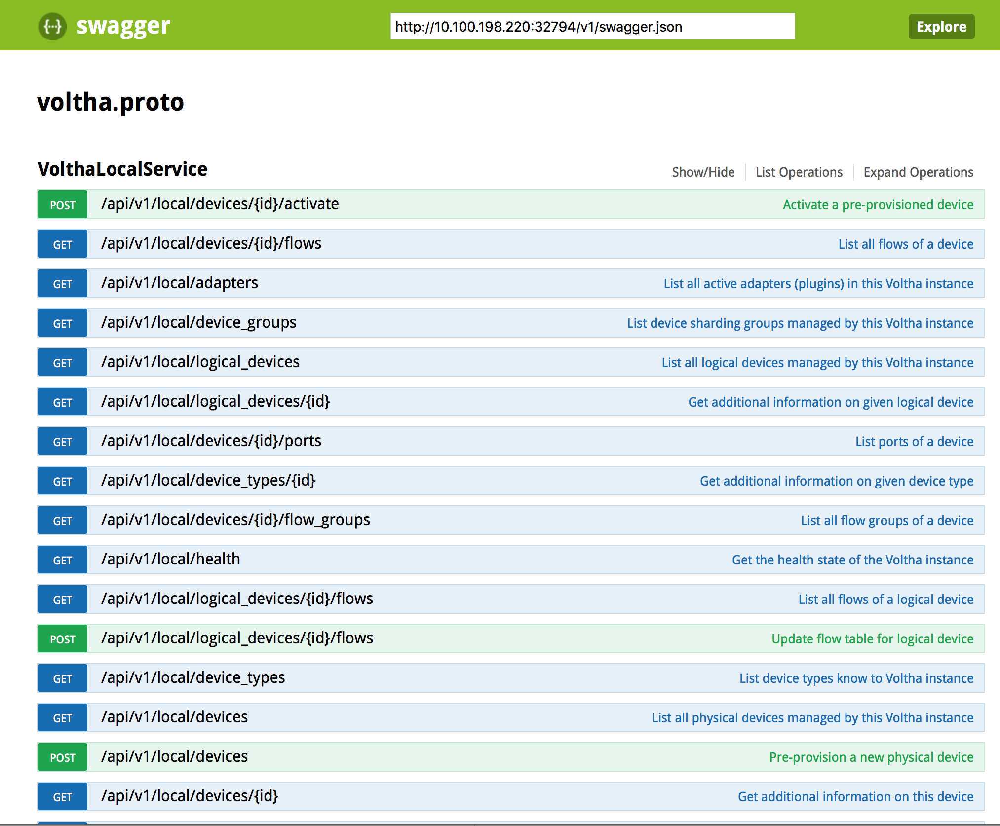
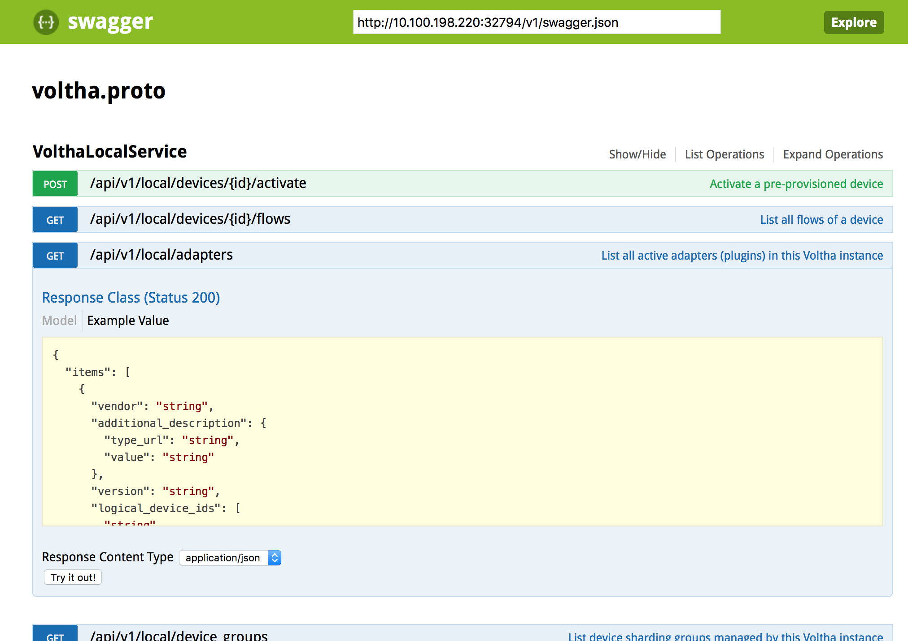
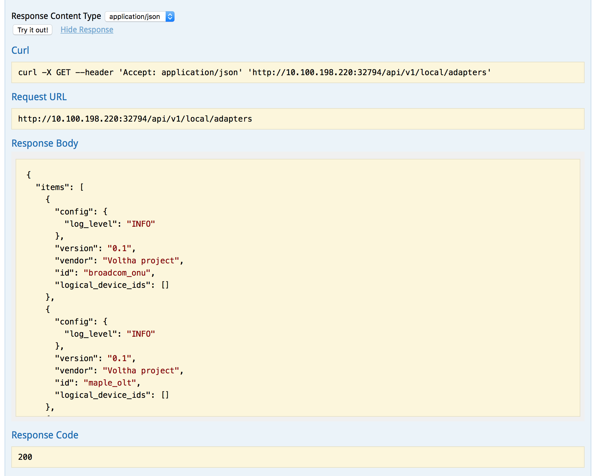

## V2 - Connect to Voltha with REST and Web Browser or Curl

### Test Objective

* The purpose of this test is to verify REST-based HTTPS connectivity to Voltha, including
  * Swagger UI access for exploring APIs
  * Command-line REST requests using curl

### Test Configuration

* Preparatory steps completed
* Test-case V1 completed successfully

### Test Procedure

To conveniently explore the REST APIs exposed by Voltha, point your browser to the default REST port on the
Voltha integrartion server's Swagger end-point using the URL
```https://<server>:<chameleon-port>/#/VolthaLocalService```, where

* ```<server>``` is the IP address or hostname of your Voltha integration server,
* ```<chameleon-port``` is the TCP port assigned to the Chameleon REST front-end.
In a real depoyment this port will be served by a load balancer using a fixed port
number, but in the integration setup this port number is a port assigned by Docker.
To find out what the port is, do either of the following:

  You can look up the port number using docker. On the integration server, run:
  
  ```
  docker inspect compose_chameleon_1 | \
      jq -r '.[0].NetworkSettings.Ports["8881/tcp"][0].HostPort'
  ```
  
  This should print the port number that is mapped to the Chameleon internal
  REST port. In our case it printed the following:
  
  ```
  32794
  ```
  
  Alternatively, you can use a DNS lookup. The Consul process in the Voltha
  ensamble also works as a DNS server and supports service record lookup. So
  you can use ```dig``` to lookup the port number. One way to do this is to issue
  the following command on *the integration server*:
  
  ```
  dig @localhost -p 8600 +short chameleon-rest.service.consul SRV
  ```
  
  This basically requests for the service record (SRV) for the service
  registered with Consul as ```chameleon-rest``` end-point. Example output:
  
  ```
  1 1 32794 0a00020f.addr.dc1.consul.
  ```
  
  The 3rd field is the port number.
  
  Either way, make note of the port-number and use this to talk to the REST APIs.
  
  Using the proper URL, which in our case was
 ```https://10.100.198.220:32794/#/VolthaLocalService``` shall lead you to the
 following view in your browser:

  

  Swagger allows the user to browse in the APIs and try any of the APIs with
  relative ease. For instance, to list all adapters registered with Voltha, open
  up the ```/api/v1/local/adapters``` entry:
  
  

  To try this API, click on the *Try it out!* button. The response will show
  up below it:
  
  

* The REST API can be consumed via any REST client. Here we verify that the Unix
 tool ```curl``` can be used. Here are a couple of examples:
 
  For convenience, setup an env var for the b ase URL:
 
  ```
  export VOLTHAURL='https://10.100.198.220:32794/api/v1/local'
  ```
 
  To show the health status of Voltha:
 
  ```
  curl -k -s $VOLTHAURL/health | jq '.'
  ```
  Expect to see:
  
  ```
  {
    "state": "HEALTHY"
  }
  ```
 
  To show the list of loaded adapters in Voltha 
  
  ```
  curl -k -s $VOLTHAURL/adapters | jq '.'
  ```
  Expect to see a list similar to this snippet (we show here only the beginning):
  
  ```
  {
    "items": [
      {
        "config": {
          "log_level": "INFO"
        },
        "version": "0.1",
        "vendor": "Voltha project",
        "id": "broadcom_onu",
        "logical_device_ids": []
      },
      {
        "config": {
          "log_level": "INFO"
        },
        "version": "0.1",
        "vendor": "Voltha project",
        "id": "maple_olt",
        "logical_device_ids": []
      },
     ...
     ...
  ```
  
  You can list only the names of the adapters:
  
  ```
  curl -k -s $VOLTHAURL/adapters | jq '.items[].id'
  ```
  
  This will show something like:
  
  ```
  "broadcom_onu"
  "maple_olt"
  "ponsim_olt"
  "ponsim_onu"
  "simulated_olt"
  "simulated_onu"
  "tibit_olt"
  "tibit_onu"
  ```

### Pass/Fail Criteria

This test case should be considered passing if all the demonstrated behavior
works with similar (but not necessarily identical) output.
